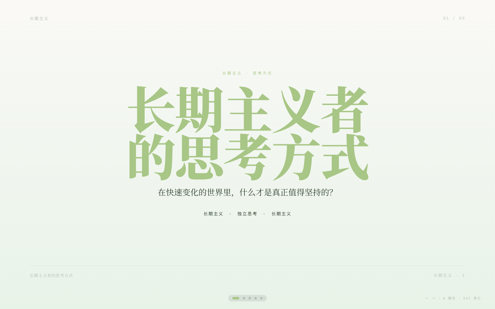
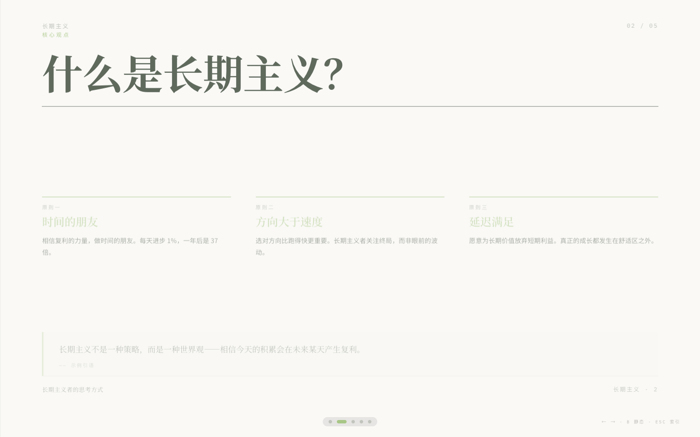
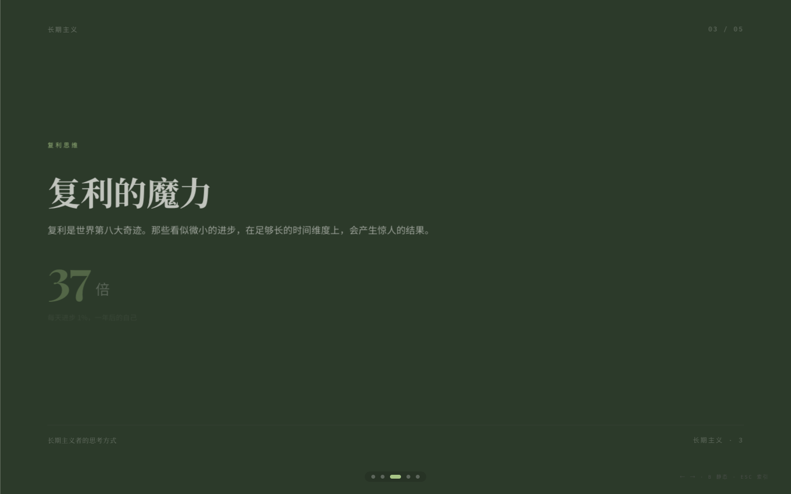
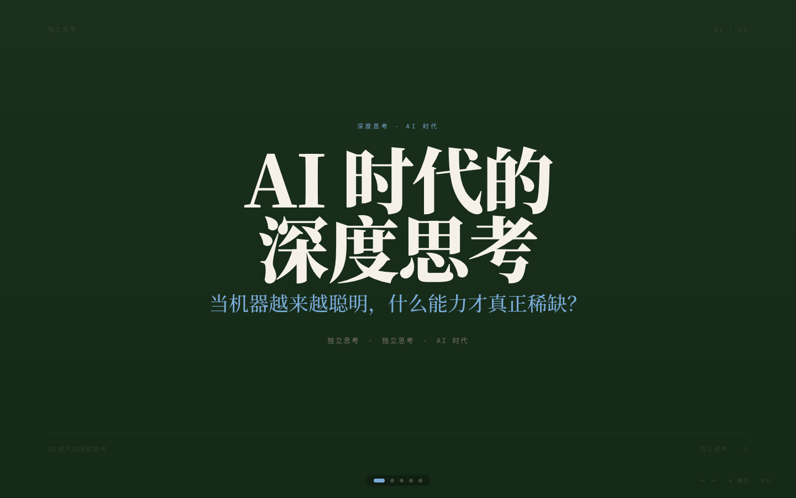
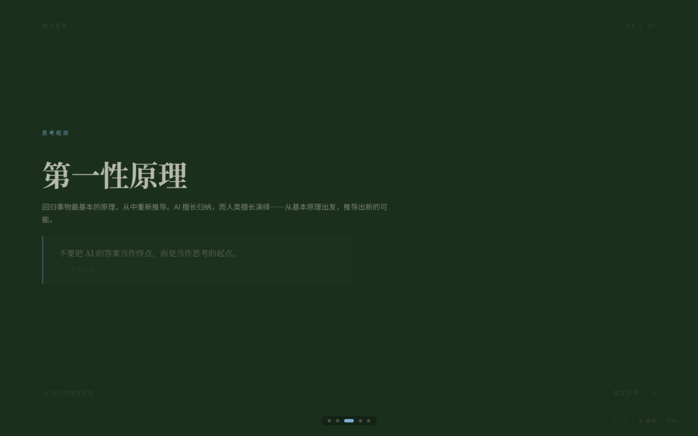
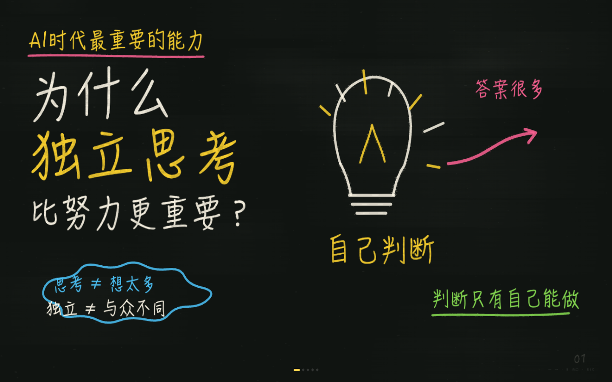
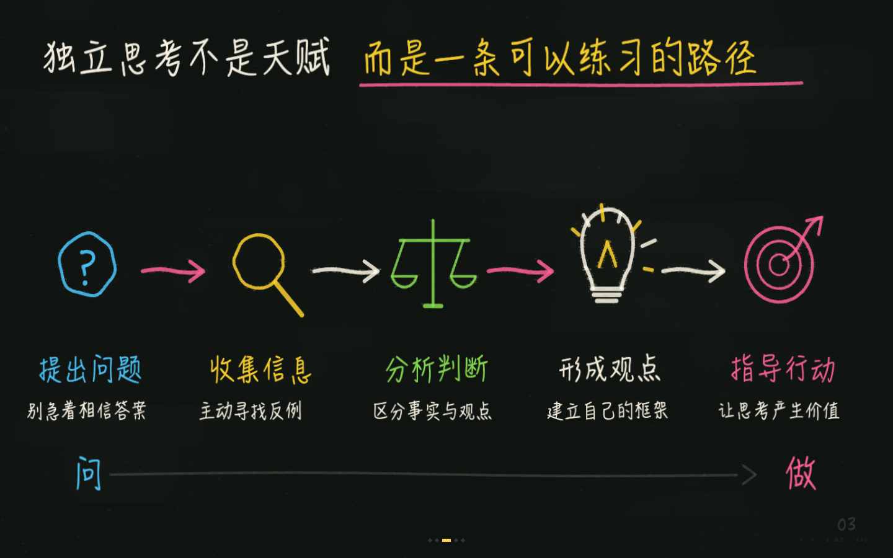
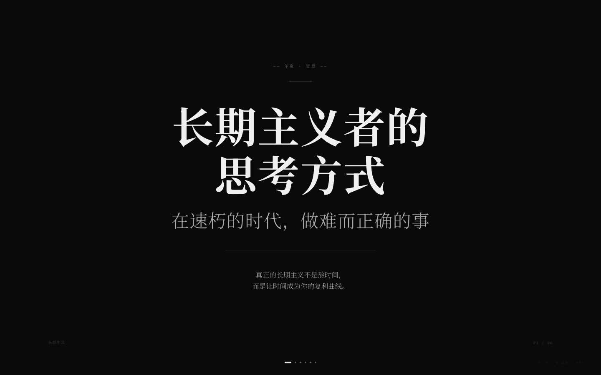
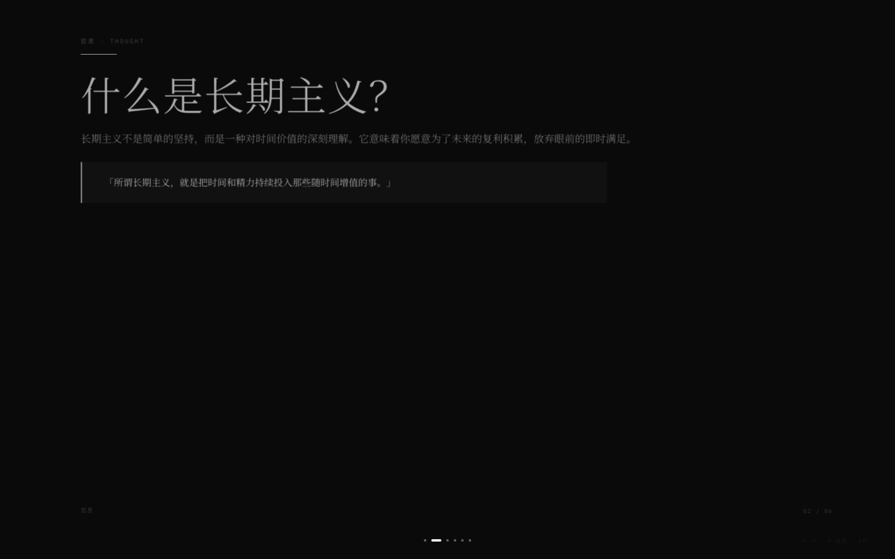

# Flycan PPT Skill · 网页 PPT

一个适配 Claude Code / Codex 等 Agent 环境的网页 PPT 技能，用于生成**单文件 HTML 横向翻页 PPT**。

内置四套视觉系统：

- **Style Avocado: 清新牛油果自然风**。像一本正在阅读的书，适合知识传播、观点表达、阅读感悟。
- **Style Dark Magazine: 深绿极简杂志风**。像一本深色主题的设计杂志，适合技术分享、AI、编程、效率系统。
- **Style Blackboard: 黑板手绘板书风**。参考粉笔知识插画分镜，用 Canvas 生成式粉笔文字、主插画、箭头、流程和圈注共同表达观点，适合教学、知识拆解。
- **Style Midnight: 午夜极简哲思风**。像深夜独处的哲思时刻，适合读书感悟、长期主义、金句总结。

项目由 Flycan 维护，设计工作流参考 guizang-ppt-skill。项目身份不会默认写入生成的 PPT。

## 30 秒开始

直接把这段话发给有 shell 权限的 AI Agent:

```text
帮我安装 flycan-ppt-skill。请把项目克隆到 ~/.claude/skills/flycan-ppt-skill，安装完成后检查 SKILL.md、assets/、references/ 是否存在。
```

安装后直接对 Agent 说：

```text
帮我基于这篇文章做一份牛油果风 PPT，控制在 6 页左右。
```

也可以试这些请求:

```text
帮我把这些读书笔记做成黑板手绘板书风的 PPT。
基于这个观点生成一份知识分享用的横向翻页 PPT。
```

## 效果

- 🥑 **Avocado Nature**: 牛油果绿主色、莫兰迪绿辅助、原木风、大量留白、治愈感
- 🌲 **Dark Green Magazine**: 深绿背景、深海蓝/古典金/玫瑰粉/冷杉绿主题色、杂志感排版
- 🎯 **Blackboard Sketch**: Canvas 粉笔知识插画、逐字粉体覆盖、手绘路径复描、彩色语义（白/黄/蓝/粉/绿）
- 🌌 **Midnight Minimal**: 纯黑底色、衬线排版、极简留白、哲学感
- 📐 **横向左右翻页**: 键盘 ← → / 滚轮 / 触屏滑动 / 底部圆点 / ESC 索引
- 🧩 **四种风格各自布局**: Avocado 10 种 / Dark Magazine 10 种 / Blackboard 6 类知识关系构图 / Midnight 10 种
- 🎨 **主题色预设**: Avocado 4 套 / Dark Magazine 4 套 / Blackboard 固定配色 / Midnight 4 套
- 📄 **单文件 HTML**: 不需要构建、不需要服务器，浏览器直接打开

## 示例

### Style Avocado · 清新牛油果自然风

[打开完整示例](examples/example-avocado.html)

| 封面 | 内容页 | 数据页 |
|------|--------|--------|
|  |  |  |

### Style Dark Green Magazine · 深绿极简杂志风

[打开完整示例](examples/example-dark-magazine.html)

| 封面 | 内容页 |
|------|--------|
|  |  |

### Style Blackboard Sketch · 黑板手绘板书风

[打开完整示例](examples/example-blackboard.html)

| 封面 | 推导页 |
|------|--------|
|  |  |

### Style Midnight Minimal · 午夜极简哲思风

[打开完整示例](examples/example-midnight.html)

| 封面 | 哲思页 |
|------|--------|
|  |  |

## 适合 / 不适合

**✅ 合适**: 知识分享 / 观点表达 / 视频制作 / 公众号改编 / 技术分享 / 阅读感悟 / 独立开发故事 / 知识拆解 / 金句总结

**❌ 不合适**: 商业汇报 / 大段数据表格 / 需要多人协作编辑（静态 HTML）

## 为什么是 HTML PPT

- **更适合 Agent 生成和修改**: HTML / CSS 是文本，Agent 能直接读、改、验证
- **表现力比 Markdown 更高**: 可以做精细排版、空间定位、动画和交互
- **交付更轻**: 单文件 HTML 可以直接打开、演示、发送、截图

## 平台支持

| 平台 | 状态 | 说明 |
|------|------|------|
| Claude Code | 支持 | 原生 Skill 工作流 |
| Codex | 支持 | 适合生成 PPT 和浏览器视觉检查 |
| Cursor / 其他本地 Agent | 可用 | 需要能读写文件并执行 shell 命令 |

## 安装

### 方式一: 把下面这段话直接发给 AI

> 帮我安装 `flycan-ppt-skill` 这个 Claude Code skill。请按下面步骤做:
>
> 1. 确保 `~/.claude/skills/` 目录存在
> 2. 执行 `git clone https://github.com/Flycan-Fanc/flycan-ppt-skill.git ~/.claude/skills/flycan-ppt-skill`
> 3. 验证: `ls ~/.claude/skills/flycan-ppt-skill/` 应该看到 `SKILL.md`、`assets/`、`references/` 三项
> 4. 告诉我安装好了

### 方式二: npx 手动安装

在终端中直接运行:

```bash
npx github:Flycan-Fanc/flycan-ppt-skill
```

或者先克隆到本地:

```bash
git clone https://github.com/Flycan-Fanc/flycan-ppt-skill.git
cd flycan-ppt-skill
npm install -g .
flycan-ppt-skill
```

安装脚本会将所有文件复制到 `~/.claude/skills/flycan-ppt-skill/`。如果想更新，在项目目录下重新运行上述任一命令即可。

### 触发方式

装好后，Claude Code 会在对话里自动发现并调用这个 skill。触发关键词:

- "帮我做一份牛油果风 PPT" / "牛油果自然风"
- "帮我做一份深绿杂志风 PPT" / "深绿极简杂志风"
- "帮我做一份黑板手绘风 PPT" / "黑板板书风"
- "帮我做一份午夜极简风 PPT" / "午夜哲思风"
- "生成一个知识分享型的 horizontal swipe deck"

## 使用流程

1. **选择风格** — Avocado Nature（牛油果自然风）/ Dark Green Magazine（深绿极简杂志风）/ Blackboard Sketch（黑板手绘板书风）/ Midnight Minimal（午夜极简哲思风）
2. **需求澄清** — 风格、受众、内容类型、素材、配图需求、主题色、硬约束
3. **拷贝模板** — 对应风格拷贝 `assets/template-*.html`
4. **填充内容** — 从对应 layout 骨架里挑、粘、改文案
5. **自检** — 对照 `references/checklist.md` 检查
6. **预览** — 浏览器直接打开
7. **迭代** — inline style 改字号/高度/间距

详细说明见 [`SKILL.md`](./SKILL.md)。

## 目录结构

```
flycan-ppt-skill/
├── SKILL.md                      ← Skill 主文件: 工作流、原则
├── README.md                     ← 本文件
├── package.json                  ← npm 包配置
├── bin/
│   └── cli.js                    ← npx 安装脚本
├── assets/
│   ├── template-avocado.html       ← 风格一: 牛油果自然风模板
│   ├── template-dark-magazine.html ← 风格二: 深绿极简杂志风模板
│   ├── template-blackboard.html    ← 风格三: 黑板手绘板书风模板
│   ├── template-midnight.html      ← 风格四: 午夜极简哲思风模板
│   └── motion.min.js               ← Motion One 本地副本
├── examples/
│   ├── example-avocado.html        ← 牛油果风完整示例
│   ├── example-dark-magazine.html  ← 深绿杂志风完整示例
│   ├── example-blackboard.html     ← 黑板风完整示例
│   ├── example-midnight.html       ← 午夜风完整示例
│   ├── avocado-cover.png           ← 牛油果封面截图
│   ├── avocado-content.png         ← 牛油果内容截图
│   ├── avocado-compound.png        ← 牛油果数据截图
│   ├── dark-magazine-cover.png     ← 深绿杂志封面截图
│   ├── dark-magazine-content.png   ← 深绿杂志内容截图
│   ├── blackboard-cover.png        ← 黑板风封面截图
│   ├── blackboard-deduction.png    ← 黑板风推导截图
│   ├── midnight-cover.png          ← 午夜风封面截图
│   └── midnight-thought.png        ← 午夜风哲思截图
└── references/
    ├── themes-avocado.md           ← 风格一: 4 套主题色预设
    ├── themes-dark-magazine.md     ← 风格二: 4 套主题色预设
    ├── themes-blackboard.md        ← 风格三: 黑板配色预设
    ├── themes-midnight.md          ← 风格四: 4 套主题色预设
    ├── layouts-avocado.md          ← 风格一: 页面布局骨架
    ├── layouts-dark-magazine.md    ← 风格二: 页面布局骨架
    ├── layouts-blackboard.md       ← 风格三: 知识关系构图骨架
    ├── chalk-rendering-blackboard.md ← 风格三: Canvas 生成式粉笔算法
    ├── layouts-midnight.md         ← 风格四: 页面布局骨架
    ├── components.md               ← 组件手册
    └── checklist.md                ← 质量检查清单
```

## 主题色预设

### Avocado Nature

从 `references/themes-avocado.md` 里选一套：

| 主题 | 核心色 | 适合场景 |
|------|--------|----------|
| 🥑 **牛油果** | `#A8C686` / `#FAF9F6` | 默认通用、知识分享 |
| 🌿 **晨露** | `#7EB68E` / `#F5F9F2` | 技术/编程/效率 |
| 🍃 **原木** | `#B5A889` / `#F8F5EE` | 阅读/人文/哲学 |
| 🌱 **春芽** | `#8FC89D` / `#F7FBF5` | 成长/独立开发/长期主义 |

### Dark Green Magazine

从 `references/themes-dark-magazine.md` 里选一套：

| 主题 | 核心色 | 适合场景 |
|------|--------|----------|
| 🌀 **深海蓝** | `#7AADD9` | 默认通用、技术/AI/编程 |
| 🏛️ **古典金** | `#D4A84B` | 知识/哲学/阅读 |
| 🌸 **玫瑰粉** | `#D97A8A` | 成长/创意/独立开发 |
| 🌿 **冷杉绿** | `#6BA87E` | 长期主义/产品/效率 |

### Blackboard Sketch

固定配色（在模板中已预设）。参考 `黑板手绘版书风.png` 和当前 Canvas 原型：大面积手写字 + 主插画 + 箭头/圈注 + 彩色粉笔语义：

| 颜色/材质 | 色值 | 用途 | 重点 |
|------|------|------|----------|
| 黑板底色 | `#101411` | 低调画布 | 低对比擦痕和稀疏颗粒 |
| 白粉笔 | `#FFF9E9` | 主体文字/轮廓 | 保持识别度 |
| 黄粉笔 | `#FFD52F` | 核心词/关键判断 | 核心词放大 |
| 蓝粉笔 | `#4DC8FF` | 问题/提示/探索 | 提问结构 |
| 粉粉笔 | `#FF6294` | 强调/转折/结论 | 结论强调 |
| 绿粉笔 | `#89E052` | 分析/判断 | 正向关系 |

### Midnight Minimal

从 `references/themes-midnight.md` 里选一套：

| 主题 | 核心色 | 适合场景 |
|------|--------|----------|
| 🌌 **星尘** | `#E8E8E8` / `#0A0A0A` | 默认通用、长期主义、哲学 |
| 🌙 **月光** | `#A8B8D9` / `#0A0A12` | 悉达多、修行、诗意哲思 |
| 🕯️ **烛光** | `#D4A84B` / `#0E0C0A` | 读书感悟、金句、温暖叙事 |
| 🌫️ **暮色** | `#B8A8D9` / `#0C0A10` | 抽象概念、感性表达 |

## 内容原则

- **第一性原理**：回归事物本质思考
- **长期主义**：关注复利和积累
- **独立思考**：不盲从、不跟风
- **理性克制**：不贩卖焦虑、不营销、不震惊体
- **朴素真诚**：用朴实的语言讲深刻的道理
- **署名中立**：默认不添加 Skill 作者、品牌、栏目或个人标签

> Blackboard 当前 Canvas 方案是生成式粉笔算法基线。构图和交互已接入正式 Skill，粉笔沉积、断触和毛糙边缘仍会继续优化。

## License

MIT © 2026 Flycan
